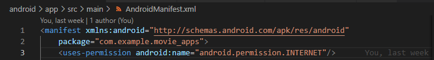

# movie_apps | Pertemuan ke 24

A new Flutter project.

## Praktikum 1: Mengkoneksikan Aplikasi Flutter ke themoviedb dengan package http

1. Untuk mengakses internet kita harus menambahkan permission internet pada android
manifest cari lah file android manifest.xml pada folder

2. Mengubah MyHomePage menjadi stateless widget.
